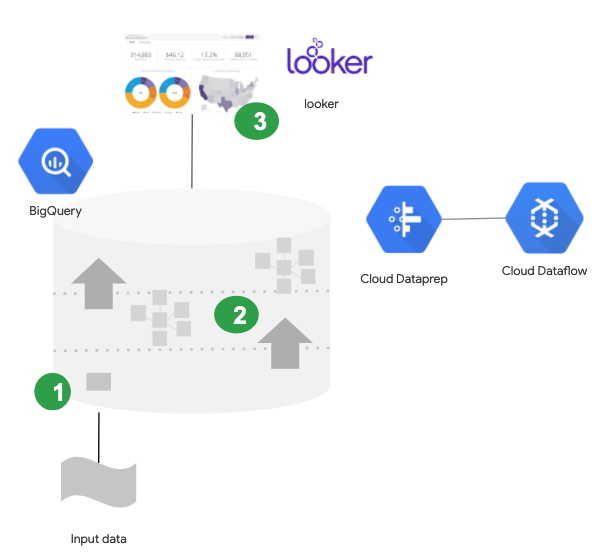

# From scratchpad to dashboard with GCP
### Hospitality industry demo in GCP

This repo contains files and code show in the Hospitality demo with GCP.
   
***GCP architecture:***



---
  
### Repository structure and contents: 
```
dataprep: Cloud DataPrep recipes code
ddl_defs: Table SQL defnitions 
looker_ml: looker model and views
raw_data: autogen CSV files
sql_elt: SQL for generating upper tables
src: autodata gen py code
01_deploy_model.sh: shell script that generates table structure using bq make
02_load_data.sh: shell script that loads the csv data using bq load
03_gen_kpis.sh: shell script that generates KPIs tanble using bq query
```